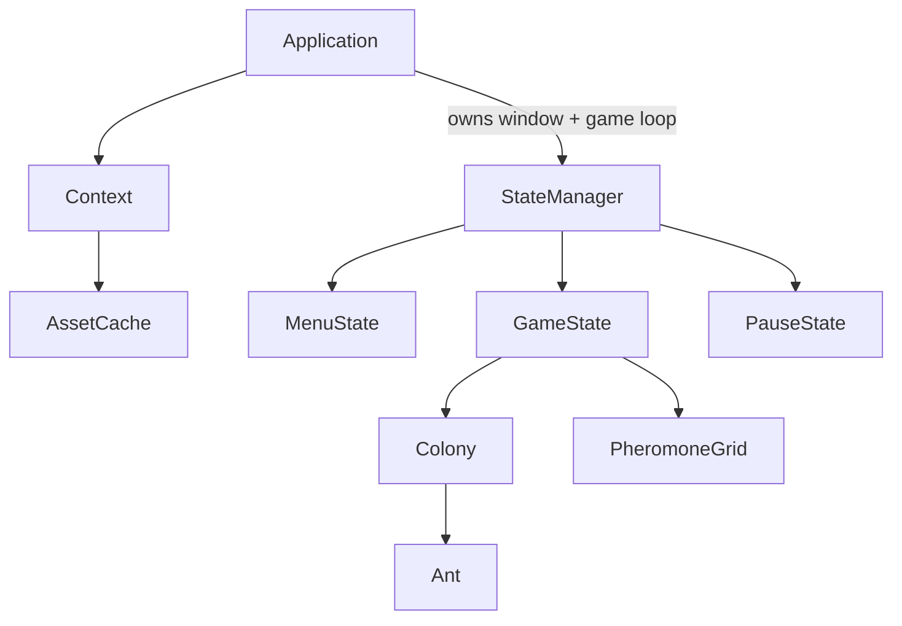

<div align="center">

# Ant Simulation

**A colony of ants that finds food without anyone telling it how.**

[](https://en.cppreference.com/w/cpp/20)
[](https://www.python.org/)
[](https://www.sfml-dev.org/)
[](https://cmake.org/)
[](LICENSE)


</div>

---

## What this is

No ant in this simulation knows where the food is. None of them has a map, a plan, or any idea what the others are doing. They wander, and when one stumbles onto food it walks home leaving a chemical trail behind it. Other ants that cross that trail tend to follow it, and leave a little more of it themselves.

Within a minute, a clean path forms between the nest and the food — and when the food runs out, the path evaporates on its own.

That mechanism is called **stigmergy**: coordination through traces left in the environment rather than through direct communication. This project implements it honestly, with no global knowledge anywhere in the code, and watches the behaviour appear on its own.

---

## How it works

Each ant runs on three simple rules, evaluated every frame:

| State | Behaviour |
|---|---|
| **Searching** | Wander with a slight forward bias, sampling pheromone in a cone ahead. Follow *food* pheromone if any is found. |
| **Returning** | Head back toward the nest, depositing *food* pheromone along the way. |
| **Always** | Deposit *home* pheromone continuously, so the way back is permanently marked. |

Two separate pheromone layers live on a grid, decoupled from the ants themselves:

- **Home pheromone** — laid by every ant, points back to the nest
- **Food pheromone** — laid only by ants carrying food, points to a source

Both **evaporate** at a fixed rate every tick. That is not a detail. Without evaporation, trails to depleted food sources never disappear and the colony gets permanently stuck on stale information. Decay is what lets the system forget, and forgetting is what lets it adapt.

The interesting part is that no line of code says *"go to the food"*. The path is never computed — it emerges from thousands of independent local decisions.

---

## Architecture



**`Application`** owns the window and the game loop, and nothing else. It holds the `StateManager` and the shared `Context`.

**`StateManager`** manages only the state stack — menu, game, pause. It knows nothing about what any state actually does.

**`Context`** carries what every state needs: the window, the `AssetCache`, and configuration.

**`PheromoneGrid`** stores both layers as flat arrays rather than a grid of objects. Ants read and write by cell index. That keeps the update cache-friendly, which starts to matter past a few thousand agents.

```
src/
├── Engine/
│   └── Core/          Application, StateManager, Context, AssetCache
├── States/            MenuState, GameState, PauseState
├── Simulation/        Colony, Ant, PheromoneGrid
└── main.cpp
tools/                 Python analysis scripts
```

---

## Build

Requires a C++20 compiler, CMake 3.20+, Ninja and vcpkg.

```bash
git clone https://github.com/LilAkai/ant_simulation.git
cd ant_simulation

cmake -B build -G Ninja \
      -DCMAKE_TOOLCHAIN_FILE=$VCPKG_ROOT/scripts/buildsystems/vcpkg.cmake \
      -DCMAKE_BUILD_TYPE=Release

cmake --build build
./build/ant_simulation
```

Build in **Release**. A debug build runs the per-ant update unoptimised and drops to a fraction of the framerate — it's the first thing people report as a bug.

---

## Analysis tools

The `tools/` directory holds Python scripts that read the CSV the simulation writes and plot what is hard to see while it runs:

```bash
pip install -r tools/requirements.txt
python tools/plot_efficiency.py runs/latest.csv
```

| Script | What it shows |
|---|---|
| `plot_efficiency.py` | Food returned per second over time |
| `plot_trails.py` | Pheromone concentration as a heatmap |
| `sweep.py` | Runs the simulation across a range of parameters and compares outcomes |

The parameter sweep is where this gets genuinely interesting: evaporation rate and deposit strength trade off against each other, and there is a narrow band where the colony is both decisive and still able to change its mind.

---

## Controls

| Key | Action |
|---|---|
| `Space` | Pause / resume |
| `Left click` | Place a food source |
| `Right click` | Place an obstacle |
| `H` | Toggle home pheromone layer |
| `F` | Toggle food pheromone layer |
| `R` | Reset the colony |
| `Esc` | Back to menu |

---

## Parameters

Tunable in `config/simulation.json`:

| Parameter | Default | Effect |
|---|---|---|
| `AntCount` | 2000 | Population size |
| `EvaporationRate` | 0.02 | How fast trails fade. Higher adapts faster but loses paths. |
| `DepositAmount` | 1.0 | Pheromone laid per step |
| `SensorAngle` | 30° | Width of the sampling cone |
| `WanderStrength` | 0.15 | Random turn added each step |

`WanderStrength` is the one to play with first. Set it to zero and the colony finds a path, then can never discover a better one — a little noise is what keeps exploration alive.

---

## Roadmap

- [ ] Multiple competing colonies
- [ ] Predators, and an alarm pheromone layer
- [ ] Nest excavation and tunnel digging
- [ ] Compute shader for the pheromone update

---

## License

MIT — see [LICENSE](LICENSE).
